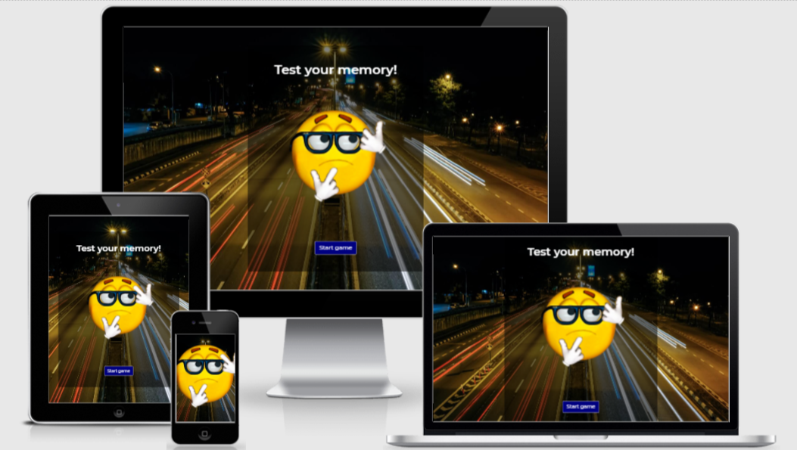
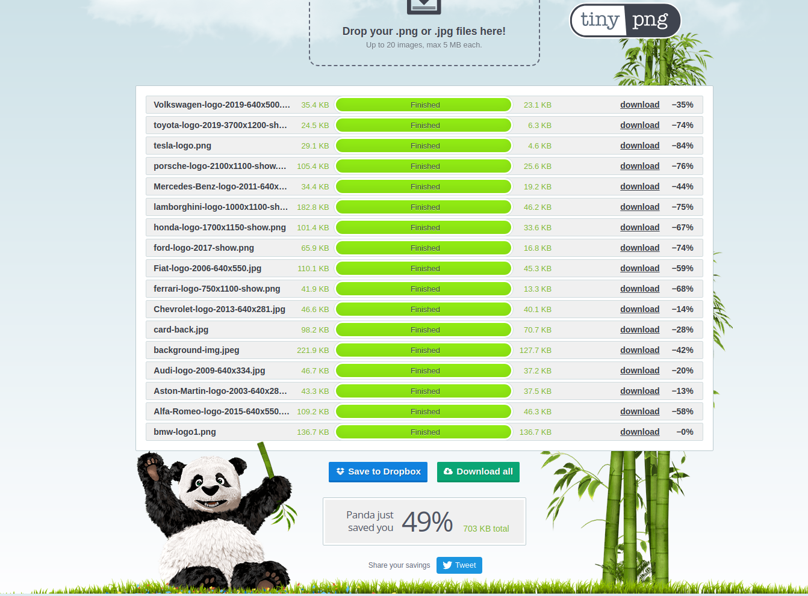
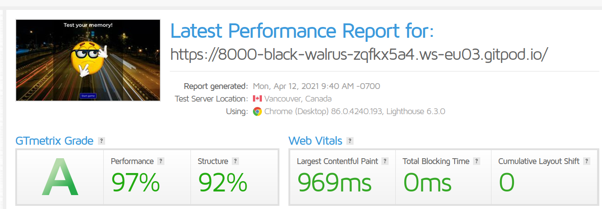
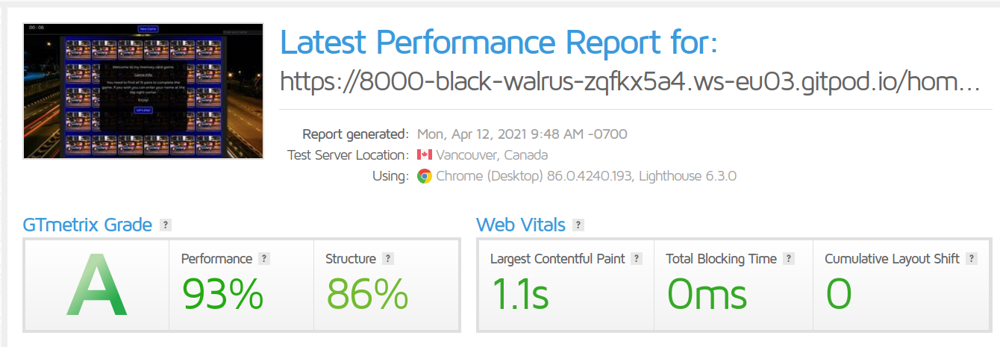

## Test Your Memory!

## Description

This project is an interactive JavaScript memory game built for my Milestone Project 2. 


[LIVE DEPLOYMENT](https://mchugh1894.github.io/testyourmemory/)

## Wireframes
The completed wireframes for this project can be accesed by clicking [Wireframes](https://github.com/McHugh1894/testyourmemory/tree/master/assets/images/readme-images/wireframes)

## UX



### User Stories
* The user should be welcomed by a jumbotron containing a message "Test your memory", a gif and a "Start Game" button at the landing page. They should be able to enter the game with a click of the "Start game" button.
* The user should be read the rules and info about the game at the welcome screen. They should be able to run the game with a simple click on the "Let's play!" button. 
* The user should see the count up timer in the top left corner in the header. 
* The user should be able to optionally enter her/his name at the top right corner in the header to receive a personalised greeting like: "Welcome [name of the player], enjoy." 
* The user should be able to click any of the cards which are facing down (not flipped already) to flip it over and try to find the right pairs. 
* The user should be able to find pairs with clicking on the cards. If they clicked two cards and these cards are the same, they match, they stay flipped. If they don't match they flip back. 
* The user should not be able to click on a new card till the two already flipped cards which are not matching and not turned back. 
* The user should be receiving an interactive message at the end of the game when all pairs found depends on how many clicks were used to find all the pairs. The messages and the click ranges are the following:

  | Clicks    | |      Messages        |
  |:--------: |-|:-----------:         |
  | 30 - 50   |-|  Heroic!          |
  | 51 - 65   |-| Champion!    |
  | 66 - 80   |-| Outstanding!           |
  | 81 - 90   |-| Brilliant!             |
  | 91 - 105  |-| Good Effort!            |
  | 106 - 120 |-| Decent!            |
  | 120 +     |-| Come on, do better!|
* The user should be able to close the pop up screen at the end of the game with a click on the "Congratulations!" button. 
* The user should be able to start a new game anytime during the game by clicking the "Restart game" button on the middle of the header, they don't need to wait till the game is finished. 
* The user should be able to click any of the social media links in the middle of the footer. When the user hovering the cursor over the social media links the hovered link should be turn grey.

## Technologies Used
The technologies i have used for this project are:

* HTML
* CSS
* JavaScript
* [Google Fonts](https://fonts.google.com)
* [Bootstrap 4](https://getbootstrap.com/)
* [Font awesome](https://fontawesome.com/)

## External resources

* [Tinypng](http://https://tinypng.com/) - Website used to compress my images to allow for faster loading times. 
* [Stack Overflow](https://fonts.google.com/) - Resource which provided the fonts for the website
* [Favicon](https://favicon.io/) - Used to create favicon for the website
* [W3C HTML Validator](https://validator.w3.org/) - Used to test HTML code on the website.
* [W3C CSS Validator](https://jigsaw.w3.org/css-validator/) - Used to test the CSS code on the website.

## Testing

### Testing All Functions
* **_Function player name:_** By clicking on the input field entered a name, on Chrome browser, there are two ways to activate the function **_first:_** when the input field lose the focus it's activating the personalised welcome message. **_second:_** Enter the name and press enter to receive the personalised message. For all the other browsers entered the player name and pressed enter. For every browser I tested was working well.  

* **_Restart game button:_** Tested several times at the beginning and at the end of the game was working fine no errors found. Tested in the middle of the game some error is discovered which are fixed. The detailed report you can find under the **_bug report and fix_** section. 

* **_Closing window function:_** Tested at the beginning with the info / welcome screen by clicking the _"Let's play!"_ button. Were no errors found. Tested at the game completion screen by pressing the _"Congratulations!"_ button. No errors found. Both screens close normally as it should be. 

* **_Personalised completion message:_** 
  * Tested by playing the game.
  * Tested by changing the variable ```clicks``` for testing of the correct message will be displayed with the correct click range in the console and console log the message. All ranges were tested and were working well. No error was found!

* **_The game logic:_** 
  * **_Card flip:_** Tested by clicking on the cards and the clicked cards was flipping over.

  * **_Found a match:_** When clicking on two cars which are the same, both card's stay flipped and locked(non clickable anymore) until the game is not complete or until a new game is not started. The match function was working fine, no error was found.

  * **_Not a match:_** When clicking on the second card and the cards are not matching, the card's turn back after a few milliseconds (let the player to memorise the cards). The cards are still clickable. The not a match function was working fine, no error was found. 

  * **_Click count:_** Tested by console logging the ```clicks``` variable after the match and not a match functions were executed and changing it by +2 (the two clicks which was used to turn the two cards) under the development status. After no errors were found the "console log" was removed from the code. 

  * **_Checking the game completion:_** There are 30 cards (15 pairs) in the game. The ```pairs``` variable was set to 15 and with every time when a pair got found the match function deducted it by 1. When ```pairs``` reach 0 that means there are no more pairs to find, the completion message will be poping up, the game was complete. Tested the function by playing the game till the end and changing the ```pairs``` variable in the console to check the completion window will pop up. The function was working well, no error was found.

* **_Browser and OS:_** The game was tested across multiple browsers(chrome, firefox, safari, internet explorer) and platform(Win10, iOS, Mac OS) PCs and on my Ipad. I asked a some of my friends to test it and give some feedback or possible bug reports.

* **_Social media links:_** All links were tested by clicking on them. All links open the required social media site in a new window, tab. While hovering over one of the links it's turns grey as highlighted. No error was found at any of the links. 

### Bugs and fixes: 
* _**The following bug reports were reported to me wich I fixed:**_
 
  * **_Bug:_** The game was playable while the info / welcome screen still was visible. 
    **_Solution:_** Locking the gameboard until the user not closing the info / welcome screen. 

### Error Testing

* [W3C HTML Validator](https://validator.w3.org/) - ALL HTML pages passed with no errors after corrections made.
* [W3C CSS Validator](https://jigsaw.w3.org/css-validator/) - CSS style sheet passed with no errors.

### Image Testing

In order to help the website load faster all of the images were removed from the website and then uploaded to [Tinypng](http://https://tinypng.com/) in order to compress the images to more reasonable file sizes to increase loading speed.



### Speed Testing

After compressing all the website images i then chose to run all my pages through [GT Metrix - Speed test](https://gtmetrix.com//) to get a view of the page load speeds.





## Deployment

* [Test Your Memory](https://mchugh1894.github.io/testyourmemory/) site is hosted using GitHub pages.

* The deployed site is hosted directly through github so all commits are live.

* To deploy on github open: https://mchugh1894.github.io/testyourmemory/ -> settings -> scroll to Guthub Pages -> Select Source -> Master Branch -> Save -> After page refresh scroll pack down to github pages section to see the deployed link.

* For local use please visit: https://mchugh1894.github.io/testyourmemory/ and clone the relevant code from the master branch by selecting code -> Then copy the url -> Open Git Bash on your system -> Change the current directory to where you want the clone to be made -> type "git clone" and paste the URL eg "https://mchugh1894.github.io/mymemorygame/" -> Press Enter to create your local clone

## Credits

* Credits go to my mentor Akshat Garg and the Codeinstitute/slack group for the help with this project.

### Media 

* [Background Image](https://unsplash.com/photos/MNke6R_VheE)
* [Flipped Cards Images](https://www.carlogos.org/car-brands/)
* [GIF For Landing Page](https://acegif.com/thinking-emoji-gifs/)
* [Card Back Image](https://blog.passmefast.co.uk/on-the-road/top-10-driving-films/)

### Credited Code  
* [Bootstrap](https://getbootstrap.com/) - Documents used for support with bootstrap classes.
